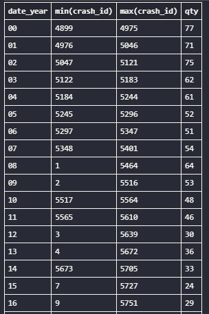

# Assumptions File

1. Where `?` or an unparseable value is found, the corresponding cleaned field is set to NULL.
2. Garbled symbols (`�`) are results of encoding issues and will be cleaned/replaced.
3. The breakdowns in parenthesis for aboard/fatalities will be extracted into separate fields for maximum analytic value.
4. Date format ambiguity will be handled by context, two-digit years will be mapped to centuries based on earliest crash data in the table.
5. Planes were invented in 1903, so it only make sense years be above 1903.

## `sql/01-Database_Creation.sql`

- [link](./sql/01-Database_Creation.sql)
- Added `crash_id` as primary key using autoincrement.
- Copy all other columns as TEXT so we can make adjustments.

## `sql/02-Cleaning.sql`

-  [link](./sql/02-Cleaning.sql)
- Date:
    - Dates in the table might be in order, so choosing between 1900 / 2000 will depend on previous rows.
        - Identified that the first `date_year = 00` started in 4899:
            - anything prior will be 1900
            - anything after that (inclusive) will be 2000

- Time:
    - Create boolean for approximate time (if it had `c`)
    - Create boolean for UTC (if had `Z`)
    - Time with `.`, digits after '.':
        -If more than 1 just remove the dot (e.g. 0.625 = 0625, 0.51 = 0051)
        - If less than 1 add padd a 0 at the end (e.g. 18.4 = 1840, 5.4 = 0540)
    - Time with whole numbers:
        - If it is single digits, assume as hours (e.g. 2 = 0200)
        - If is is double digits, assume as minutes (e.g. 20 = 0020)
        - If it is triple digits, will pad a 0 at the beginning (e.g. 200 = 0200)
    - Remove all ponctuation and letters (`;`,`"`, `:`, `c`, `d`, `Z`) and convert the fild into a 4 digits integer
        - Treat `;`,`"`, `:` as ":" (e.g. 8;50 = 0850, 8"50 = 0850)
    - Use that field to get Hours and Minutes
        - Assume `00:00` is an actual time (midnight) not a missing information
    - 

- Location: 
    - Check number of row breaks in ech cell, keep the first appearance
    - Count the number of commas in the new field
    - Create boolean for approximate (if it had `Near`)
    - Create boolean for environment (if it had `Off` then 'Water' else 'Land')

- Operator:
    - Create boolean for military, private and airtaxi

- Flight No:
    - Standardized by replacing '?' or blank with NULL; otherwise left as-is.

- Route:
    - Remove `t:`, `:`, `,-`
    - Standardize route separators as " - " except where part of a city name

- Aircraft Type
    - Check if there is line breaks within the cell and keep only the first row
    - Assume the format of field is Make / Model
        -  Create columns for Make and Model following this logic

- Registration
    - Create 2 columns assuming `/` as a divisor
    - Assume `1/2/2003` is `NULL`

- Construction/line number
    - Remove spaces

- Aboard
    - Extracted total/passenger/crew counts using string parsing; set to NULL if any component was unparseable or '?'.

- Fatalities
    - Extracted total/passenger/crew counts using string parsing; set to NULL if any component was unparseable or '?'.

- Ground:
    - Set missing or '?' to NULL; 
    - Did not impute zero by default.

- Summary:
    - `Unknown` as NULL
    - Create a short summary using the first phrase (using `.` as end point of a phrase)

## `notebooks/02-Data_Profiling_cleaned.ipynb`

- [link](./notebooks/02-Data_Profiling_cleaned.ipynb)
- Duplicate records were identified using strict composite keys, primarily (date, time, location), or the entire row where appropriate.
- For duplicates detected, the first occurrence was retained; all subsequent duplicates were removed automatically.
- No manual or record-by-record curation was performed for exceptions or special cases.
- As a result, some records that may be more complete but not the first occurrence might be dropped, and some near-duplicates may remain if they do not match on the chosen key(s).
- The deduplication logic is fully automated and reproducible for scalability in large datasets.

### Feature Engineering

- Computed fatality rate as `fatalities_total_count / aboard_total_count`; set to NULL if aboard count is zero or missing.
- Severity is classified as:
    - `Total`: fatality rate == 1
    - `High`: fatality rate >= 0.5 but < 1
    - `Low`: fatality rate > 0 but < 0.5
    - `None`: fatality rate == 0
- Cause category is a simple keyword match on the cleaned summary text; if no keyword matches, labeled as 'other'.

